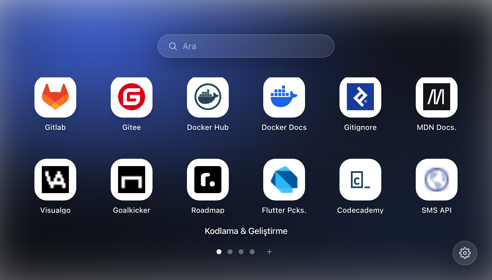

# Hexpane: New Tab

> A beautiful, customizable new tab — your shortcuts, organized into spaces.

<p align="center">
  
</p>

Hexpane replaces Chrome's default new tab with a macOS Launchpad–style launcher:
a centered grid of app shortcuts over a soft, blurred gradient background. Group
shortcuts into **spaces**, pull them into **folders**, search across everything,
and switch your background from a curated palette of gradients — all saved
locally and built to stay out of your way.

## Features

- **Launchpad-style layout** – A clean, centered grid of large app icons with
  labels, a search field on top, and page dots at the bottom.
- **Spaces (pages)** – Group shortcuts into separate spaces (e.g. *Coding*,
  *Design*, *Social*). Add, rename, and delete spaces; switch between them with
  the dots, the **mouse wheel**, or the **← / →** arrow keys (clamped at the
  first and last page).
- **Folders** – Drag one shortcut onto another to create a folder (iOS /
  Launchpad style). Drop more shortcuts in, open a folder to launch/rename, and
  remove items; folders dissolve automatically when emptied.
- **Live search** – Type to filter shortcuts across every space instantly.
- **Gradient backgrounds** – Pick from a curated set of soft, multi-color mesh
  gradients (with subtle blur + film grain), or choose **Random** to get a fresh
  one on every new tab. No image URLs needed.
- **Quick-access shortcuts** – Add a shortcut with a name and a URL; its favicon
  is fetched automatically and cached as a data URL for instant, offline-capable
  loading.
- **Settings** – A focused settings modal split into **Appearance** (theme +
  background) and **General** (language + about).
- **Light & Dark theme** – Class-based dark mode across the settings UI.
- **Internationalization** – English and Turkish locales via `vue-i18n`.
- **Local persistence** – Spaces, shortcuts, folders, theme, language, and the
  chosen background are stored in the browser's local storage.

## Tech Stack

- **[Vue 3](https://vuejs.org/)** – Application framework (`<script setup>`)
- **[Tailwind CSS v4](https://tailwindcss.com/)** – Styling via `@tailwindcss/vite`
- **[Pinia](https://pinia.vuejs.org/)** – State (spaces/folders, theme, language,
  favicon cache)
- **[Vue Router](https://router.vuejs.org/)** – Routing
- **[vue-i18n](https://vue-i18n.intlify.dev/)** – Internationalization (en, tr)
- **[Vite](https://vitejs.dev/)** – Build tooling and dev server
- **Chrome Extension (Manifest V3)** – Packaged as a `chrome_url_overrides`
  new tab page. Icons are inline SVG (no icon font).

## Installation

### From source (load unpacked)

1. Install dependencies (this project uses [pnpm](https://pnpm.io/)):
   ```bash
   pnpm install
   ```
2. Build the extension:
   ```bash
   pnpm build
   ```
   This produces a `dist/` folder containing the packaged extension.
3. Open Chrome and navigate to `chrome://extensions`.
4. Enable **Developer mode** (top-right toggle).
5. Click **Load unpacked** and select the generated **`dist/`** folder.
6. Open a new tab to see Hexpane.

## Usage

- **Switch spaces** – Click a page dot, scroll the mouse wheel, or press
  **← / →**. Click the space name to rename or delete it; use the **+** next to
  the dots to add a space.
- **Add a shortcut** – Click the **+** tile, enter a title and URL (e.g.
  `example.com`, normalized to `https://`). The favicon is fetched and cached.
- **Make a folder** – Drag one shortcut onto another. Drop more onto the folder
  to add them; click the folder to open, rename, launch, or remove items.
- **Search** – Type in the top search field to filter across all spaces.
- **Change the background / theme** – Open **Settings** (bottom-right gear) →
  **Appearance**, pick a gradient (or **Random**) and toggle light/dark.

## Development

```bash
pnpm install
pnpm dev
```

The dev server runs on `http://localhost:3000`. Note that extension-specific
behavior (the new tab override, packaged icons, and the copied `manifest.json`)
only exists in a production build — use `pnpm build` and **Load unpacked** to
test inside Chrome.

| Script                | Description                                              |
| --------------------- | -------------------------------------------------------- |
| `pnpm dev`            | Start the Vite development server                        |
| `pnpm build`          | Build the extension into `dist/` (strips preload links)  |
| `pnpm preview`        | Preview the production build locally                     |
| `pnpm remove-preload` | Strip `rel="preload"` link tags from the build's HTML    |

## Project Structure

```
hexpane/
├── manifest.json          # Chrome extension manifest (Manifest V3)
├── index.html             # App entry HTML
├── vite.config.mjs        # Vite config (Vue, Tailwind, fonts, static copy)
├── remove-preload.js      # Post-build helper to strip preload links
└── src/
    ├── main.js            # App bootstrap (imports Tailwind CSS)
    ├── App.vue            # Root component (router outlet)
    ├── assets/
    │   ├── css/main.css   # Tailwind import + glass/utility layer
    │   └── icon/          # Extension icons (48, 128, favicon)
    ├── layouts/           # BaseLayout (dark class + i18n wiring)
    ├── components/        # AppCard, GlassModal, SettingsModal, Icon (inline SVG)
    ├── views/home/        # HomeView – Launchpad grid, folders, modals
    ├── utils/gradients.js # Curated background gradient presets
    └── plugins/
        ├── index.js       # Registers router, Pinia, i18n
        ├── router/        # Vue Router setup
        ├── stores/        # Pinia stores (area-store, theme-store)
        └── i18n/          # vue-i18n setup and locale files (en, tr)
```

## License

Released under the [MIT License](LICENSE).
